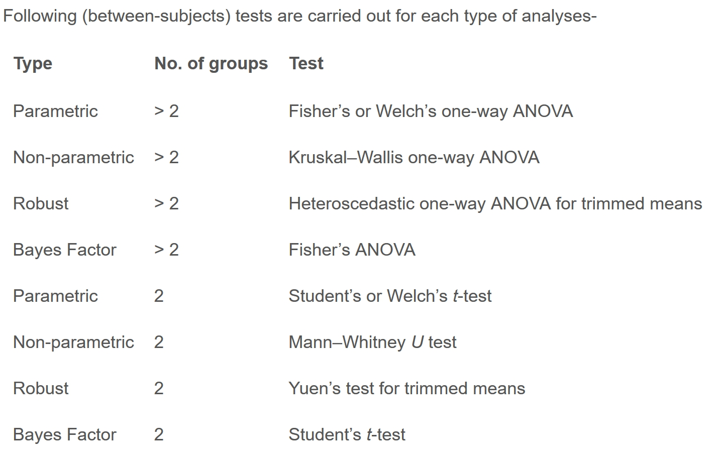

# Visual Statistical Analysis

## Learning Outcome

In this hands-on exercise, you will gain hands-on experience on using:

-   ggstatsplot package to create visual graphics with rich statistical information,

-   performance package to visualise model diagnostics, and

-   parameters package to visualise model parameters

## Visual Statistical Analysis with ggstatsplot

[**ggstatsplot**](https://indrajeetpatil.github.io/ggstatsplot/index.html) is an extension of [**ggplot2**](https://ggplot2.tidyverse.org/) package for creating graphics with details from statistical tests included in the information-rich plots themselves.

\- To provide alternative statistical inference methods by default. - To follow best practices for statistical reporting. For all statistical tests reported in the plots, the default template abides by the \[APA\](https://my.ilstu.edu/\~jhkahn/apastats.html) gold standard for statistical reporting. For example, here are results from a robust t-test:


## Getting Started

### Installing and launching R Packages

In this exercise, **ggstatsplot** and **tidyverse** will be used.

```{r}
pacman::p_load(ggstatsplot, tidyverse)
```

### Importing Data

In the code chunk below, read_csv() of readr package is used to import Exam_data.csv into R and saved it into a tibble data.frame.

```{r}
exam <- read_csv("Data/Exam_data.csv")
```

### One-sample test: *gghistostats()* method

In the code chunk below, [*gghistostats()*](https://indrajeetpatil.github.io/ggstatsplot/reference/gghistostats.html) is used to to build an visual of one-sample test on English scores.

```{r}
set.seed(1234)

gghistostats(
  data = exam,
  x = ENGLISH,
  type = "bayes",
  test.value = 60,
  xlab = "English scores"
)
```

Default information: - statistical details - Bayes Factor - sample sizes - distribution summary

### Unpacking the Bayes Factor

-   A Bayes factor is the ratio of the likelihood of one particular hypothesis to the likelihood of another. It can be interpreted as a measure of the strength of evidence in favor of one theory among two competing theories.

-   That’s because the Bayes factor gives us a way to evaluate the data in favor of a null hypothesis, and to use external information to do so. It tells us what the weight of the evidence is in favor of a given hypothesis.

-   When we are comparing two hypotheses, H1 (the alternate hypothesis) and H0 (the null hypothesis), the Bayes Factor is often written as B10. It can be defined mathematically as

    

<!-- -->

-   The [**Schwarz criterion**](https://www.statisticshowto.com/bayesian-information-criterion/) is one of the easiest ways to calculate rough approximation of the Bayes Factor.

### How to interpret Bayes Factor

A **Bayes Factor** can be any positive number. One of the most common interpretations is this one—first proposed by Harold Jeffereys (1961) and slightly modified by [Lee and Wagenmakers](https://www-tandfonline-com.libproxy.smu.edu.sg/doi/pdf/10.1080/00031305.1999.10474443?needAccess=true) in 2013:


### Two-sample mean test: *ggbetweenstats()*

In the code chunk below, [*ggbetweenstats()*](https://indrajeetpatil.github.io/ggstatsplot/reference/ggbetweenstats.html) is used to build a visual for two-sample mean test of Maths scores by gender.

```{r}
ggbetweenstats(
  data = exam,
  x = GENDER, 
  y = MATHS,
  type = "np",
  messages = FALSE
)
```

Default information: - statistical details - Bayes Factor - sample sizes - distribution summary

### Oneway ANOVA Test: *ggbetweenstats()* method

In the code chunk below, [*ggbetweenstats()*](https://indrajeetpatil.github.io/ggstatsplot/reference/ggbetweenstats.html) is used to build a visual for One-way ANOVA test on English score by race.

```{r}
ggbetweenstats(
  data = exam,
  x = RACE, 
  y = ENGLISH,
  type = "p",
  mean.ci = TRUE, 
  pairwise.comparisons = TRUE, 
  pairwise.display = "s",
  p.adjust.method = "fdr",
  messages = FALSE
)
```

-   “ns” → only non-significant

-   “s” → only significant

-   “all” → everything

#### ggbetweenstats - Summary of tests




### Significant Test of Correlation: *ggscatterstats()*

In the code chunk below, [*ggscatterstats()*](https://indrajeetpatil.github.io/ggstatsplot/reference/ggscatterstats.html) is used to build a visual for Significant Test of Correlation between Maths scores and English scores.

```{r}
ggscatterstats(
  data = exam,
  x = MATHS,
  y = ENGLISH,
  marginal = FALSE,
  )
```

### Significant Test of Association (Depedence) : *ggbarstats()* methods

In the code chunk below, the Maths scores is binned into a 4-class variable by using [*cut()*](https://www.rdocumentation.org/packages/base/versions/3.6.2/topics/cut).

```{r}
exam1 <- exam %>% 
  mutate(MATHS_bins = 
           cut(MATHS, 
               breaks = c(0,60,75,85,100))
)
```

In this code chunk below [*ggbarstats()*](https://indrajeetpatil.github.io/ggstatsplot/reference/ggbarstats.html) is used to build a visual for Significant Test of Association

```{r}
ggbarstats(exam1, 
           x = MATHS_bins, 
           y = GENDER)
```

## Extra Alternative

```{r}
set.seed(1234)

ggcorrmat(
  data = exam,
  cor.vars = c(ENGLISH, MATHS, SCIENCE),
  type = "nonparametric",
  sig.level = 0.05,
  p.adjust.method = "holm",
  colors = c("#D6604D", "white", "#2166AC"),
  title = "MATHS and SCIENCE scores are \nmost strongly correlated",
  caption = "Spearman correlations, Holm-corrected | n = 322 | Source: Exam_data.csv",
  ggtheme = theme_minimal(base_size = 13),
  ggplot.component = list(
    theme(
      plot.title = element_text(face = "bold", size = 14),
      plot.caption = element_text(colour = "grey55", size = 8),
      legend.position = "none"
    )
  )
)
```

The exercise looks at MATHS and ENGLISH scores in isolation using ggscatterstats(). This alternative uses ggcorrmat() to compare all three subjects at once. The matrix shows that MATHS and SCIENCE scores tend to move together most closely (ρ = 0.86), while ENGLISH is somewhat less tied to either. In other words, students who do well in one tend to do well in the other, but this pattern is strongest between the two non-language subjects.