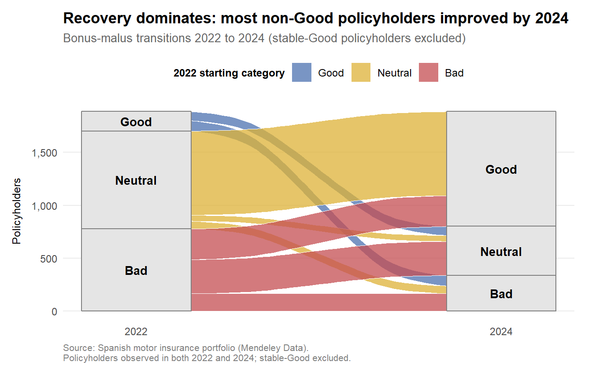

## Contents

::: incremental
1.  **The Problem** — What underperforming portfolios look like
2.  **The Data** — The Spanish motor portfolio at a glance
3.  **Univariate snapshot** — Three structural features shape the analysis
4.  **Data Quality and Analytical Robustness** — Three defensive checks
5.  **Findings** — Four loss drivers
    -   Finding 1: Loss ratio rose 9 points in two years
    -   Finding 2: COMP_N runs at 94% loss ratio
    -   Finding 3: The bonus-malus paradox
    -   Finding 4: Geography and age interactions
6.  **Volatility view** — Profitability ≠ Predictability
7.  **Beyond standard techniques** — Three diagnostic methods
    -   Bonus-malus transitions (Sankey)
    -   Concentration and Clustering (Lorenz + heatmap)
8.  **Summary** — Key Findings and Future Research
:::

::: notes
Good afternoon. This presentation summarises a visual analytics study of a Spanish motor insurance portfolio covering 2022 to 2024 across 352,340 policy-year records. The framing follows Swiss Re's 2019 sigma report on underperforming portfolios. The structure is five parts: context, data, four loss drivers identified in the bivariate analysis, three diagnostic methods that go beyond standard techniques by exploiting panel structure, loss concentration, and multivariate similarity, and finally a summary with directions for future research. Each finding pairs visual evidence with statistical validation.
:::

## The Problem

::: callout-note
"Insurers often carry underperforming portfolios where the root causes of poor profitability and high volatility are unknown."

— Swiss Re Institute (2019), *sigma 4/2019*
:::

**Three structural features of motor portfolios:**

-   Premiums are exposure-weighted
-   Claims arrive frequently enough to support segment-level inference
-   An improvement of two to five percentage points in loss ratio can separate a profitable portfolio from a loss-making one

**Analytical objectives:**

1.  Characterise the distributional shape of the portfolio
2.  Identify the segments where premium and exposure are out of balance

::: notes
The starting point is Swiss Re's observation that insurers routinely carry portfolios whose loss drivers are not well understood. Motor insurance is a particularly fertile setting for visual analytics: claim volumes are high enough that segment-level patterns emerge clearly, and the margin between profit and loss is narrow enough that even small loss-ratio movements matter. The two objectives set by this exercise are descriptive and diagnostic. The descriptive objective profiles the variables' distributions. The diagnostic objective identifies where premium charged and losses incurred have drifted out of alignment.
:::

## The Data — Spanish Motor Portfolio at a Glance

{fig-align="center"}

-   352,340 policy-year records across 184,725 policyholders covering 2022–2024.
-   47 variables describing policies, vehicles, premiums, exposure, and claims.
-   Portfolio aggregates: €104.4M premium, €73.4M incurred, **70.3% loss ratio**.
-   Dominated by mid-tier comprehensive (CC + COMP_E ≈ 84%); smallest tier **COMP_N at 5%** is the most consequential for the loss-ratio analysis.

::: notes
The dataset is a real-world Spanish motor insurance portfolio published through Mendeley Data. It has the granularity needed for coverage-specific decomposition: premium, claim counts, and incurred losses are broken out for seven coverage categories within each policy-year record. The portfolio is dominated by mid-tier comprehensive policies, with CC and COMP_E together accounting for roughly 84 percent of records. The smallest tier, COMP_N at 5 percent of policies, turns out to be the most consequential segment for the loss-ratio analysis. The portfolio aggregate loss ratio of 70 percent is close to the standard motor break-even benchmark before expense loading.
:::

## Univariate snapshot: three structural features shape the analysis

{fig-align="center"}

:::::: columns
::: {.column width="33%"}
**1. Distributional skew**

Policy-level loss ratios span four orders of magnitude. **Log scales** are used throughout.
:::

::: {.column width="33%"}
**2. Class imbalance**

**96.5%** of policies sit in the Good bonus tier; CC and COMP_E account for **84%** of records.
:::

::: {.column width="33%"}
**3. The zero-claim majority**

**\~85%** of policy-years have no claims. The bivariate analysis uses **exposure-weighted ratios of sums** per segment.
:::
::::::

::: notes
Before diving into the bivariate analysis, three structural features of the data are worth highlighting because they shape every methodological choice that follows. First, distributional skew: vehicle values span several orders of magnitude and policy-level loss ratios span four, which forces log-scale plotting throughout the report. Second, class imbalance: 96.5 percent of policies sit in the Good bonus tier, and CC and COMP_E together account for 84 percent of records. Statistical tests must therefore handle unequal group sizes, which is why I use non-parametric Kruskal-Wallis rather than ANOVA. Third, the zero-claim majority: roughly 85 percent of policy-years have no claims, making policy-level loss ratio a noisy individual measure. This is the reason the bivariate analysis aggregates to segment level using exposure-weighted ratios of sums rather than averaging policy-level ratios.
:::

## Data Quality and Analytical Robustness

Three defensive checks support the findings:

:::::: columns
::: {.column width="33%"}
**Missingness profiling**

The 1,800 dropped records carry higher premiums and more claims than retained ones. The missingness is not random and is flagged as a limitation.
:::

::: {.column width="33%"}
**Cancellation analysis**

COMP_N has the lowest cancellation rate in the portfolio (7.8%). Its 94% loss ratio reflects real pricing inadequacy, not partial-premium truncation.
:::

::: {.column width="33%"}
**Within-vs-between decomposition**

Of the 8.9-point loss-ratio swing between 2022 and 2024, 8.5 points come from within-segment deterioration. The book's policy-type mix barely shifted; existing segments themselves got worse.
:::
::::::

Sanity checks also confirmed valid value ranges, internal consistency between coverage components and totals, and a uniquely-keyed panel on **insured_id**.

::: notes
Before the substantive findings, three defensive checks support the analysis. First, missingness profiling: the 1,800 records dropped via listwise deletion are not missing at random — they skew higher-premium and higher-claim than the retained population, flagged as a limitation. Second, the cancellation analysis rules out partial-premium bias for COMP_N's 94% loss ratio: COMP_N has the lowest cancellation rate in the portfolio at 7.8%, so its loss ratio reflects genuine pricing inadequacy. Third, the within-versus-between decomposition splits the 9-point loss-ratio swing into 8.5 points from within-segment deterioration and only 0.1 from mix shift, ruling out the mix-shift narrative and motivating the segment-level drill-down. Beyond these, sanity checks confirm no out-of-range values, internal consistency between coverage-specific columns and totals, and panel uniqueness on insured_id.
:::

## Finding 1: Loss ratio rose 9 points in two years

{fig-align="center" width="65%"}

**Statistical validation.** The 95% bootstrap intervals for 2022 and 2023 overlap substantially, but the 2024 interval sits entirely above both.

**Decomposition.** Of the 8.9-percentage-point swing, 8.5 points arise from within-segment deterioration. The portfolio's mix barely shifted; existing segments themselves got worse.

::: notes
The first headline is the temporal trajectory. Portfolio loss ratio rose from 65.7 percent in 2022 to 74.7 percent in 2024, a nine-point swing in two years. To rule out a small-sample artefact, the bootstrap distribution of loss ratio was computed for each year using five hundred resamples. The 2022 and 2023 distributions overlap substantially; the 2024 distribution sits entirely above both. To diagnose the source of the deterioration, I ran a within-versus-between decomposition. The within-segment effect accounts for 8.5 of the 8.9 percentage points; the between-segment effect contributes only 0.1pp. The book's policy-type composition was stable; what changed was the loss ratio inside each existing segment. This rules out a mix-shift explanation and motivates the segment-level drill-down that follows.
:::

## Finding 2: COMP_N runs at 94% loss ratio

{fig-align="center"}

- COMP_N covers 5% of the portfolio but runs at a **93.5% loss ratio**, distinct from every other tier in pairwise testing.
- Loss ratio rises across tiers: TP 54%, TPG 70%, CC 63%, COMP_E 74%, **COMP_N 94%**.
- The 94% isn't a cancellation artefact — COMP_N has the portfolio's lowest cancellation rate at 7.8%.

::: notes
The second headline is the coverage-tier mispricing. The five policy types show a clear monotonic gradient in loss ratio, from fifty-four percent on basic third-party to ninety-four percent on comprehensive without excess. COMP_N sits twenty-four percentage points above the seventy percent break-even benchmark before any expense loading is applied. A Kruskal-Wallis test followed by FDR-adjusted pairwise comparisons confirms that COMP_N is statistically distinct from every other tier. Importantly, the cluster heatmap shown later groups all three bonus-malus tiers within COMP_N together, indicating that the elevated loss profile is structural to the product rather than driven by customer mix. The cancellation analysis in the report also confirms COMP_N is not biased by partial-premium truncation.
:::

## Finding 3: The bonus-malus paradox

{fig-align="center" width="55%"}

**Neutral pays less but loses more.** Claim frequency and average premium both rise monotonically from Good to Neutral to Bad. Loss ratio does not: Neutral runs at 81.9%, materially above Bad at 79.6%.

::: notes
The third finding inverts the expected ordering. Claim frequency rises monotonically from Good to Neutral to Bad, as it should. Average premium per exposure does the same, indicating that the bonus-malus surcharges are being applied. But loss ratio does not follow that pattern. Neutral runs at eighty-two percent, materially above Bad at eighty percent, despite Neutral collecting twenty-six percent less premium per exposure. Two non-exclusive explanations are plausible: new entrants land in Neutral by default before claim history accumulates, or bonus-malus transitions are downward-rigid with claimants staying in Neutral. The panel-data analysis in the next section examines the rigidity hypothesis directly and rules it out, leaving the default-tier explanation as the more plausible one.
:::

## Finding 4: Geography and age interactions

::::: columns
::: {.column width="50%"}
{fig-align="center" width="100%"}

**Islands carry the widest spread.** Rural island policies run at a 65.8% loss ratio, while urban island policies run at 77.2%. The 11-point spread is the largest within-category gap in the geographic dimension.
:::

::: {.column width="50%"}
{fig-align="center" width="100%"}

**Young drivers in old vehicles carry the highest risk.** The worst-performing cell in the surface is under-25 drivers in vehicles aged 16 years or more.
:::
:::::

::: notes
The fourth finding identifies two non-additive interactions. On the geographic dimension, the islands category shows an eleven-percentage-point loss-ratio spread between rural island policies at sixty-six percent and urban island policies at seventy-seven percent. Within-category heterogeneity of that magnitude indicates that aggregate municipality-level summaries mask the underlying pattern. On the driver and vehicle age dimension, the worst cell in the joint surface is under-twenty-five drivers in vehicles aged sixteen years or older. The interaction is concentrated in the youngest driver segment, which is consistent with the actuarial expectation that age extremes carry wider risk distributions.
:::

## Volatility view: Profitability ≠ Predictability

{fig-align="center" width="65%"}

**Two distinct underwriting profiles emerge:**

-   COMP_N is the worst-performing tier (94% loss ratio) but the most predictable (CV 7.6).
-   COMP_E sits closer to break-even on average (74%) but carries the highest within-segment volatility (CV 123), driven by a heavy claim-severity tail.

::: notes
Profitability and predictability are conceptually distinct dimensions, and the scatter view separates them clearly. COMP_N has the worst segment loss ratio in the portfolio but the lowest within-segment coefficient of variation, meaning its loss experience is consistent and easy to forecast. COMP_E shows the opposite profile: a moderately high mean loss ratio paired with the highest within-segment volatility in the book, driven by occasional large-severity claims that dominate its variance. These two segments illustrate that profitability and predictability operate on independent dimensions. CC, the largest segment, combines a moderate loss ratio with mid-range volatility, the most balanced profile in the portfolio.
:::

## Beyond standard techniques: Bonus-malus transitions

{fig-align="center"}

- 99.6% of Good policyholders stay Good.
- **86.0%** of Neutral and **78.8%** of Bad policyholders improve by 2024.
- Recovery dominates. The Neutral paradox in Finding 3 reflects short-term loss-ratio behaviour, not transition rigidity.

::: notes
The first method beyond the standard curriculum exploits the panel structure of the dataset. The same policyholder appears in multiple years, which permits direct visualisation of transitions between bonus-malus categories. The Sankey diagram excludes the ninety-nine percent of policyholders who remained Good throughout the period to surface the transition dynamics. Among the remaining policyholders, upward movement dominates: 86% of Neutrals and 78.8% of Bads improved by 2024. This rules out the downward-rigid transitions hypothesis raised in Section 4.4. The Neutral pricing paradox is therefore about the short-term loss-ratio behaviour of policyholders sitting in the Neutral pool, not about any structural rigidity in the transition rules. The default-tier under-loading hypothesis remains plausible and would need longitudinal modelling to confirm.
:::

## Beyond standard techniques: Concentration and Clustering

::::: columns
::: {.column width="50%"}
**Lorenz curve, Gini = 0.956**

{fig-align="center" width="100%"}

The top 10% of policies bear 99% of incurred losses but a much smaller share of premium. Premium does not scale with losses.
:::

::: {.column width="50%"}
**Cluster heatmap: 3 risk profiles**

{fig-align="center" width="100%"}

COMP_N · Neutral and Bad cluster together. COMP_N · Good sits with the main book. The mispricing is in the worse bonus tiers, not the product overall.
:::
:::::

::: notes
Two more diagnostic methods. First, the Lorenz curve and Gini coefficient show how unevenly losses are distributed across the policy population. The Gini of 0.956 is extreme: the bottom 85 percent of policies contribute nothing to total losses, while the top 10 percent account for 99 percent. The same top decile contributes a much smaller share of total premium, the portfolio-level manifestation of the segment-level mismatches in Section 4. Second, the cluster heatmap uses hierarchical clustering on a four-metric segment profile. Three groups emerge. The diagnostic finding is that COMP_N · Neutral and Bad cluster together while COMP_N · Good sits with the main book, showing the mispricing concentrates in the worse bonus tiers within COMP_N rather than spanning the product uniformly. A small singleton outlier, TPG · Bad, is statistically distinct and warrants individual attention.
:::

## Summary

**Four loss drivers identified:**

-   **Temporal deterioration:** 9-point swing, 95% within-segment.
-   **COMP_N mispricing:** 24 points above benchmark, structurally distinct.
-   **Bonus-malus paradox:** Neutral runs worse than Bad; rigidity ruled out.
-   **Geography and age interactions:** Wide within-category heterogeneity.

**Three beyond-standard diagnostics:**

-   **Sankey:** Recovery dominates, ruling out transition rigidity.
-   **Lorenz / Gini = 0.956**: Extreme loss concentration.
-   **Cluster heatmap**: COMP_N risk concentrates in worse bonus tiers.

**Future research:**

- **Causal inference** to confirm whether loss-ratio gaps reflect risk or confounding.
- **Telematics and finer geography** to refine segment-level diagnostics.
- **Longitudinal modelling** of bonus-malus dynamics to test the default-tier hypothesis.
- **External benchmarking** to clarify portfolio-specific vs generalisable findings.
- **Missingness mechanism** modelling to test whether dropped records bias findings.

::: notes
To summarise, the bivariate analysis identifies four loss drivers, each statistically validated. The temporal deterioration is driven by within-segment changes, not by a mix shift toward worse segments. The COMP_N coverage tier is structurally mispriced. The bonus-malus mechanism produces an unexpected paradox at Neutral, with transition rigidity ruled out by the panel analysis. Geographic and age interactions are non-additive. The three beyond-standard methods exploit features the standard techniques cannot reach: panel structure, loss concentration, and multivariate similarity. The findings are exploratory rather than confirmatory. Future research should apply causal-inference methods, incorporate telematics and finer geographic granularity, extend the panel analysis to formal longitudinal modelling, and benchmark against the broader Spanish motor market.
:::

## Thank you {.center}

**Full technical report:**\
`isss-608-vaa-demo-t85z.vercel.app/TH_EX01_report.html`

**Source repository:**\
`github.com/invincible1000/ISSS608-VAA_demo`

**Data source:**\
Spanish motor insurance portfolio, Mendeley Data

::: notes
The technical report containing all code, statistical detail, and methodological reflection is published at the URL on screen. The source repository contains the rendered HTML, the Quarto source, and the analytical sandbox preparation pipeline. The raw data is downloadable from Mendeley Data; instructions for re-acquisition are in Section 1.3 of the report. I am happy to take questions on any of the findings, the methods, or the underlying data preparation choices.
:::
